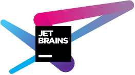

![][banner]

[![][actions]][actions-link]
<!--[![][releases]][releases-link]-->
[![][downloads]][releases-link]

[![][license]](LICENSE)

## 简介

基于Sora实现的第三方开源仿宠物世界

## 推荐框架

<table>
<tr>
  <td><a href="https://github.com/Hoshinonyaruko/Gensokyo">Gensokyo</a></td>
  <td>基于QQ开放平台Api开发的符合 OneBot 协议端实现</td>
</tr>
<tr>
  <td><a href="https://github.com/NapNeko/NapCatQQ">NapcatQQ</a></td>
  <td>现代化的基于 NTQQ 的 OneBot 协议端实现</td>
</tr>
</table>
注意：不再推荐使用OpenShamrock作为框架，该项目已归档，不支持心跳，且 QQ 9.0.80 对其添加了新的检测

## 相关链接
[爱发电](https://afdian.net/a/S2Arp)

## 感谢

[banner]: https://socialify.git.ci/OnQ114514/OpenPetsWorld/image?description=1&forks=1&issues=1&logo=https%3A%2F%2FOnQ114514.github.io%2Flogo.png&stargazers=1&theme=Auto

[actions]: https://img.shields.io/github/actions/workflow/status/OnQ114514/OpenPetsWorld/dotnet.yml?style=for-the-badge

[actions-link]: https://github.com/OnQ114514/OpenPetsWorld/actions/workflows/build-apk.yml

[releases]: https://img.shields.io/github/v/release/OnQ114514/OpenPetsWorld?style=for-the-badge

[releases-link]: https://github.com/OnQ114514/OpenPetsWorld/releases

[downloads]: https://img.shields.io/github/downloads/OnQ114514/OpenPetsWorld/total?style=for-the-badge

[license]: https://img.shields.io/github/license/OnQ114514/OpenPetsWorld?style=for-the-badge